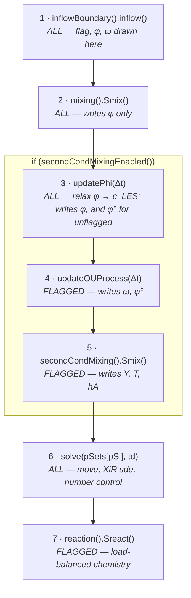
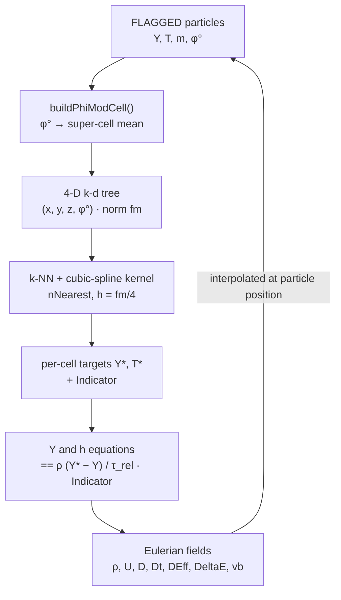

# SPFoam with Second Conditioning

How the flagged particle subset is conditioned on a stochastically modified progress
variable, how the two mixing levels divide the scalars between them, which particles
actually integrate chemistry, and how the Kernel Estimator carries that subset back onto
the Eulerian fields.

Every claim below is anchored to `file:line` in this repository.

**Contents**

1. [The gate](#1-the-gate)
2. [Particle state](#2-particle-state)
3. [The conditioning](#3-the-conditioning)
4. [Timestep sequence](#4-timestep-sequence)
5. [The mixing](#5-the-mixing)
6. [Chemistry](#6-chemistry)
7. [Kernel-estimator coupling](#7-kernel-estimator-coupling)
8. [Dictionaries](#8-dictionaries)
9. [Modification notes](#9-modification-notes)

Throughout, **ALL** marks an operation applied to every particle in the cloud and
**FLAGGED** marks one applied only to the second-conditioning subset.

---

## 1. The gate

Every second-conditioning branch tests the same predicate:
`cloud.secondCondMixingEnabled()`, which is simply *"was the second mixing model
constructed?"* (`MixingPopeCloudI.H:45`)

```cpp
template<class CloudType>
inline bool Foam::MixingPopeCloud<CloudType>::secondCondMixingEnabled() const
{
    return secondCondMixingModel_.valid();
}
```

The pointer is only set when three conditions hold at construction
(`MixingPopeCloud.C:45-84`): the `secondConditioning` sub-dictionary exists in
`cloudProperties`, it carries `enabled true`, and `subModels/secondCondMixingModel` names
a registered mixing model (an unknown name is a `FatalError` listing the valid types).
One level up, `ThermoPopeCloud` defines the same query as a virtual returning `false`
(`ThermoPopeCloud.H:230`), so every cloud in the hierarchy can be asked the question and
clouds without the mixing layer answer no.

That single predicate gates seven distinct behaviours. Turn it off and SPFoam is the
unmodified baseline solver on every one of them:

| Site | Behaviour when enabled |
|---|---|
| `moveParticles.H:51` | Runs steps 3–5 (φ relaxation, OU advance, second mixing) |
| `MMCcurl.C:217` | First-level mixing switches from composition to **φ only** |
| `ReactingPopeParticle.C:61` | Unflagged particles return before chemistry |
| `BalanceReactModel.C:70` | Unflagged particles are excluded from the load-balanced reaction list |
| `KernelEstimation.C:156` | Coupling particle list is filtered to the subset; sub-sampling disabled |
| `KernelEstimation.C:109` | φ° super-cell projection uses flagged particles only |
| `ThermoPopeCloud.C:401` | Eulerian statistics skip unflagged particles |

---

## 2. Particle state

`MixingPopeParticle` gains four members (`MixingPopeParticle.H:139-148`). All four are
full cloud fields — written, read back on restart, and available to particle statistics
(`MixingPopeParticleIO.C:123-258`, `MixingPopeParticle.C:285-287`).

| Member | Meaning | Set at creation | Advanced by |
|---|---|---|---|
| `secondCondFlag` | Subset membership, `0` or `1` | Bernoulli: `rndGen().Random() < R` | Never — fixed for the particle's life |
| `omegaOU` | OU state ω, stationary *N*(0,1) | `N(0,1)` if flagged, else stays 0 | `updateOUProcess()`, flagged only |
| `phi` | Reaction progress variable φ ∈ [0,1] | `(T - Tu)/(Tb - Tu)`, clamped | Mixed by level 1, then relaxed toward the Eulerian `c` |
| `phiModified` | Modified progress variable φ° | `phi * exp(beta * omegaOU)` | Recomputed each step from φ and ω |

```cpp
// MixingPopeCloud.C:390-420 — setParticleProperties()

// Assign second-conditioning subset flag based on fraction R
particle.secondCondFlag() =
    (secondCondR_ > 0 && this->rndGen_.Random() < secondCondR_) ? 1 : 0;

// Initialize progress variable from particle temperature
const scalar dT = secondCondTb_ - secondCondTu_;
particle.phi() = max(0.0, min(1.0, (particle.T() - secondCondTu_)/dT));

// Stationary OU draw — flagged particles only
if (particle.secondCondFlag() == 1)
    particle.omegaOU() = this->rndGen_.Normal(0, 1);

particle.phiModified() =
    particle.phi() * Foam::exp(secondCondBeta_ * particle.omegaOU());
```

Because ω is 0 for unflagged particles, φ° collapses to φ for them — no special case is
needed anywhere downstream. Note also that the flag is drawn *per particle at injection*,
so the subset is a fixed random ~`R` fraction of the cloud that is continuously refreshed
as particles enter and leave the domain.

---

## 3. The conditioning

### Level one — the MMC reference space

Unchanged from baseline mmcFoam. The reference variables are declared in
`mmcVariablesDefinitions` as three shadow-position coordinates evolved by a stochastic
differential equation, alongside the coupling variable `z`:

```cpp
variables
{
    z   { name z;   couplingName z; passive true; mixStep 1; MMCType couplingVar;   }
    sPx { name sPx; MMCType referenceVar; referenceType sde; }
    sPy { name sPy; MMCType referenceVar; referenceType sde; }
    sPz { name sPz; MMCType referenceVar; referenceType sde; }
}
```

Each `sde` reference variable is integrated once per particle move via
`evolveMethod().compute(p, dt, XiROld)` (`MixingPopeParticle.C:65-67`), which calls the
Itô model's drift, diffusion and integrate steps (`sde.C:34-47`). These three values live
in the particle's `XiR()` array as `XiR()[0..2]`, and are read **positionally** by the
second level.

### Level two — a stochastic degree of reaction

The second level conditions on **φ°**, a progress variable perturbed by an independent
Ornstein–Uhlenbeck process. Three ingredients:

**1 · the progress variable and its anchoring.** φ is seeded from the particle temperature
at injection, mixed pairwise by level 1, and then relaxed towards the **Eulerian progress
variable** `c` interpolated at the particle position, for **ALL** particles
(`MixingPopeCloud::updatePhi`):

```
c      = clamp((T_LES - Tu)/(Tb - Tu), 0, 1)     // SPFoam.C, each time step
c_p    = interpolate(c) at the particle position

phi   <- phi + (1 - exp(-dt/tauC)) * (c_p - phi)
phi   <- clamp(phi, 0, 1)
```

The update is the exact solution of `dphi/dt = (c_p - phi)/tauC` for constant `c_p`, so it
is independent of `dt` — the same construction `OUStateUpdate()` uses for ω. `tauC -> 0`
makes φ a pure interpolation of `c`; `tauC -> inf` makes it free-running.

> **Removed: the `W(φ)` source.** Earlier versions drove φ with
> `W(φ) = A(1−φ)·exp[Z(φ−1)]`. That term is **non-negative for every φ ≤ 1** and has no
> dependence on temperature, mixture, or proximity to a flame, so it drove *every* particle
> in the domain monotonically to φ = 1 — cold reactants included — on a timescale of about
> `[ln(1/ε) + e^Z/Z]/A`. φ became a function of residence time rather than of reaction, and
> once it saturated `φ° = φ·exp(βω)` degenerated into **pure OU noise**. Conditioning the
> level-2 tree on that pairs particles at random and averages their `Y`, `T`, `hA`, which
> homogenises composition and extinguishes the flame. Cases still setting `A_phi`/`Z_phi`
> now fail with a `FatalError` rather than silently changing behaviour.

**2 · the OU process.** ω is integrated with an *exact* discrete update — no truncation
error, valid at any Δt (`OUProcessUpdate.H:79-89`):

```
d(omega) = -(1/tau) * omega dt + sqrt(2/tau) dW

omega(t+dt) = omega(t) * exp(-dt/tau) + sqrt(1 - exp(-2 dt/tau)) * xi,   xi ~ N(0,1)
```

τ = `tauOU`. The stationary distribution is *N*(0,1) independent of Δt, which is why the
initial draw at particle creation is also *N*(0,1) — the process starts already in
equilibrium.

**3 · the modified variable.**

```
phi_deg = phi * exp( beta * omega )
```

β = `beta`. This is the actual conditioning coordinate of the second level: a log-normal
multiplicative perturbation of the progress variable whose spread is set by β and whose
correlation time is set by τ. Setting β = 0 collapses φ° onto φ and makes the second
level a purely deterministic re-conditioning on progress.

Steps 2 and 3 are applied together to **FLAGGED** particles only, in
`MixingPopeCloud::updateOUProcess`; for unflagged particles φ° is kept equal to φ inside
`updatePhi()` instead.

Note that `exp(βω)` with ω ~ *N*(0,1) has mean `exp(β²/2) > 1`, so φ° is biased high
relative to φ, and its spread grows fast: at β = 1 the 5–95% range of the multiplier already
spans a factor of ~27, enough to swamp whatever physical content φ carries. Keep β small.

---

## 4. Timestep sequence

The Eulerian side runs first: `rhoEqn`, then the PIMPLE loop with the momentum equation,
the sub-grid burning-velocity factor `vb`, the reference and coupling variable equations
(`XiEqn.H`), the species and enthalpy equations (`hYEqvE_Eqn.H`) and the pressure
correctors (`SPFoam.C:113-162`). Only after the PIMPLE loop closes does the particle block
run (`SPFoam.C:170`). Order inside that block is load-bearing.



Why this order and not another:

- **Step 3 after step 2** — `Smix()` completes for the whole cloud before the relaxation
  fires, so it acts on post-mixing φ values rather than interleaving mixing and relaxation
  particle-by-particle.
- **Step 4 after step 3** — φ° must reflect the *anchored* φ, so the OU advance and the φ°
  recompute happen together, after the relaxation.
- **Step 5 after step 4** — the second level reads φ° as its dominant k-d tree split axis.
  A stale φ° would sort particles into the wrong bins.
- **Step 7 last** — chemistry integrates the composition the second level has just
  produced.

With the guard off, control passes straight from step 2 to step 6
(`moveParticles.H:19-119`).

---

## 5. The mixing

Both levels run the same four-stage machinery inherited from `mixParticleModel`
(`mixParticleModel.C:692-704`):

```
Smix() -> buildParticleList() -> findPairs() -> SmixList() -> mixpair()
```

`secondCondMMCcurl` overrides `buildParticleList()` and `mixpair()`; everything else — the
k-d tree, the pair/triple assembly, the dispatch loop — is shared code.

### Who mixes what

The critical design point: when second conditioning is on, the first level stops mixing
composition entirely and mixes **only φ** (`MMCcurl.C:217-233`). Y, T and hA are then
mixed exactly once, by the second level. No scalar is mixed twice.

```cpp
// MMCcurl.C:217-237 — inside mixpair()
if (this->owner().secondCondMixingEnabled())
{
    // first conditioning mixes ONLY the progress variable phi
    const scalar wtSum = p.wt() + q.wt();
    if (wtSum > VSMALL)
    {
        const scalar phiAv = (p.wt()*p.phi() + q.wt()*q.phi())/wtSum;
        p.phi() += mixExtent*(phiAv - p.phi());
        q.phi() += mixExtent*(phiAv - q.phi());
    }
}
else if (!this->owner().sootingFlame())
{
    particleType::mixProperties(p, q, mixExtent);   // baseline: Y, hA, XiC
}
```

| Quantity | Level 1 · `MMCcurl` | Level 2 · `secondCondMMCcurl` |
|---|---|---|
| Population | ALL | FLAGGED |
| Reference space | (ξx, ξy, ξz) shadow positions | (φ°, ξx, ξy, ξz) |
| `phi` | mixed | not mixed |
| `Y`, `T`, `hA` | not mixed | mixed |
| `XiR`, `XiC`, flag | not mixed | not mixed |
| Pairing | `local` / `global` / `subVolumes` | `local` only |

### Building the second-level list

The override filters on the flag, then packs the 4-D reference vector into the same
`eulerianFieldData::XiR()` slot the base class uses, so the shared k-d tree needs no
modification (`secondCondMMCcurl.C:97-165`):

```cpp
// secondCondMMCcurl.C:114-158 — buildParticleList()
forAllIters(this->owner(), iter)
{
    // Filter: include only particles flagged for second conditioning
    if (iter().secondCondFlag() != 1)
        continue;

    this->particleList_.append(iter.get());
    eulerianFieldData eulerianFields;
    ...
    eulerianFields.XiR().resize(4);
    eulerianFields.XiR()[0] = iter().phiModified();  // tight normaliser
    eulerianFields.XiR()[1] = iter().XiR()[0];       // xi_x
    eulerianFields.XiR()[2] = iter().XiR()[1];       // xi_y
    eulerianFields.XiR()[3] = iter().XiR()[2];       // xi_z

    eulerianFields.magSqrRefVar().resize(4, 0.0);    // aISO does not use it
    // DEff, D, Dt, DeltaE, mu, vb interpolated at the particle position
}
this->findPairs(this->eulerianFieldDataList_, this->particlePairs_);
```

Compared with the base version (`mixParticleModel.C:160-311`), three things are dropped:
the `magSqr(grad(Xi))` fields (unused by the aISO timescale), the per-particle random
number, and the parallel branch `correctParticleListParallel()` — the second level pairs
**on-processor only**.

### How pairs are found

`KkdTreeLikeSearch` recursively bisects the index list. At each node it measures the extent
of every reference axis, normalises it, and splits on whichever is largest
(`mixParticleModel.C:906-986`):

```
split axis   i* = argmax_i ( max_i - min_i ) / Xii_i
ncond = 3 + i*
```

The `3 +` offset points `lessArg` past the three physical coordinates
(`mixParticleModel.H:167-186`), so **physical position is never a split axis** — the
physical-space branches are commented out (`mixParticleModel.C:937-956`). Both levels use
this same inherited search, so both condition on their reference variables alone. A
consequence worth noting: `r_i` is a mandatory dictionary entry (the base constructor reads
it) but takes no part in pairing under `pairingMethod local`.

Because the normalisers *divide*, a **small** value makes an axis **more** likely to be
chosen — so tightening `phiMod_m` gives φ° more weight.

The subtlety that matters in practice is that the tree compares **root extents, not local
gradients**. At the top node the shadow axes span the whole cloud while φ° spans its own
order-unity range:

```
shadow axis :  L_cloud / sP_m        e.g. 0.05 / 4.2e-5  ~ 1200
phi-degree  :  range(phi_deg) / phiMod_m   e.g. 1.24 / 0.1 = 12.4
```

The tree then spends its entire depth budget (`D ~ log2(N_rank/2.5)`) cutting the three
shadow axes down, and φ° is never the widest axis at any level. With three shadow axes
against one φ° axis, **equal root normalised extents give φ° about a quarter of the
splits**, which is the sensible target.

This is why `secondCondMMCcurlCoeffs/Xim_i` is read from **this model's own dictionary**
and is not the same as `MMCcurlCoeffs/Xim_i`. Level 1 already enforces fine-grained
locality on the whole cloud; level 2 needs only coarse shadow locality plus fine φ°
resolution, so its `sP*_m` should be substantially looser. Copying the level-1 values
across makes the shadow axes utterly dominant and φ° is effectively never selected.

Do not chase φ° weight by shrinking `phiMod_m` below ~β: `φ° = φ·exp(βω)` scatters by
about `φ·β` at fixed φ, so a normaliser below that resolves OU noise rather than reaction
progress.

### The mixing timescale

Identical in form to `MMCcurl`'s aISO branch, evaluated from Eulerian quantities
interpolated at each particle (`secondCondMMCcurl.C:291-321`):

```
tau_p     = (1 / vb_p) * DeltaE_p^2 / ( CE * (D_p + Dt_p) )

tau_mix   = 2 / (1/tau_p + 1/tau_q)      [meanTimeScale true]
          = min(tau_p, tau_q)            [meanTimeScale false]

mixExtent = 1 - exp( -dt / tau_mix )
```

`vb` is the sub-grid burning-velocity factor built each PIMPLE iteration in
`SPFoam.C:124-142`; Δ_E is the LES filter width. If either diffusivity sum underflows the
pair is skipped entirely. Only `CE` enters — `CL` is accepted for dictionary compatibility
with `MMCcurl` and warns if set to anything other than its default.

Then the mix itself — a weighted pair mean relaxed by `mixExtent`, applied to exactly
three quantities (`secondCondMMCcurl.C:344-376`):

```
psi_bar = (w_p * psi_p + w_q * psi_q) / (w_p + w_q)

psi_p  <- psi_p + mixExtent * (psi_bar - psi_p),   psi in { hA, T, Y }
```

### Built-in diagnostics

`buildParticleList()` ends with a diagnostics block that reduces across processors and
reports: the global flagged-particle count, the number of pairs and triples, a
**split-axis histogram** over the four reference axes (`phiModified`, `xi_x`, `xi_y`,
`xi_z`), and the realised **φ° range**. The histogram is the direct check on the balance
between conditioning and shadow-space locality — φ° taking roughly a quarter of the splits
is the target. The φ° range matters because φ° is
**not** bounded by 1 even though φ is, which interacts with the coupling's `fHigh` gate.
The same numbers are appended as a tab-separated row to
`<case>/postProcessing/secondCondMMCcurl.log` by the master process, with a header on
first write.

`MixingPopeCloud::updatePhi` additionally reports the weighted mean `|φ − c|` each step —
the direct measure of whether φ is tracking the resolved progress variable or drifting away
from it:

```
    [secondCond] mean |phi - c| = 0.0182 (tauC = 0.0005 s, relax = 0.632)
```

---

## 6. Chemistry

Two independent code paths solve chemistry, and both are gated on the flag.

### Path A — per-particle, inside `solve()`

Used when `balanceReactionLoad false`. The guard sits in `ReactingPopeParticle::calc`,
*after* the parent `calc()` has run (`ReactingPopeParticle.C:57-80`):

```cpp
ParticleType::calc(cloud, td, dt, cellI);   // transport + XiR sde: ALL particles

// Non-subset particles skip chemistry integration.
if (cloud.secondCondMixingEnabled() && this->secondCondFlag() == 0)
    return;

if (!cloud.balanceReactionLoad())
    cloud.reaction().calculate(t0, dt, hA(), pc(), T(), XiC(cVarName), Y());
```

The placement matters: position advance, the shadow-position SDE and particle-number
control still run for **ALL** particles. Only the ODE integration is skipped.

### Path B — load-balanced, via `Sreact()`

Used when `balanceReactionLoad true` (the SPFoam default path, `moveParticles.H:87-107`).
`BalanceReactModel` assembles a compact list of particle states, redistributes it across
processors by measured CPU cost, integrates, and writes the results back. The flag filter
appears in three places and must stay consistent, because the write-back walks the cloud
and the reaction list in lockstep by index:

| Location | Role |
|---|---|
| `BalanceReactModel.C:70` | Build: unflagged particles never enter `reactParList` |
| `BalanceReactModel.C:170` | Write-back, first-timestep branch |
| `BalanceReactModel.C:313` | Write-back, steady-state branch (guarded by an `origId` check under `FULLDEBUG`) |

> **Consequence to keep in mind**
>
> Unflagged particles are excluded from second-level mixing, from chemistry, from the
> thermophysical coupling and from Eulerian statistics. Their `Y`, `T` and `hA` are
> therefore frozen at their injection values for the whole of their life in the domain —
> they carry only φ, position and shadow positions. This is deliberate (the comment at
> `KernelEstimation.C:170-171` says their composition "is stale and must not bias the
> Eulerian target fields"), but it means the unflagged population is not a physically
> meaningful sample of anything except φ.

---

## 7. Kernel-estimator coupling

The Lagrangian field only reaches the Eulerian solution through one channel: a per-cell
*target* composition and temperature, relaxed into the transport equations. The Kernel
Estimator builds those targets.

### Where it enters the equations

Once per timestep, on the first PIMPLE iteration (`hYEqvE_Eqn.H:28-37`):

```cpp
if (pimple.firstIter())
{
    pSets.first().coupling().EqvETargetValues(Xi, YEqvETarget, TEqvETarget);
    hEqvETarget = thermoEqvETarget.he(p, TEqvETarget);
}
...
fvScalarMatrix YiEqn
(
    fvm::ddt(rho, Yi) + mvConvectionYi->fvmDiv(phi, Yi)
  - fvm::laplacian(rho*DEff, Yi)
 ==
    (rho * (YTarget - Yi) / tauRel) * Indicator
);
```

```
S_Y = rho (Y* - Y) / tau_rel * I          S_h = rho (h* - h) / tau_rel * I
```

`Indicator` (I) is 0 or 1 per cell — it is the switch that turns the source off wherever
the kernel produced nothing. `tauRel` is the blended relaxation time from `XiEqn.H:1-24`:
it ramps from `tauRelaxStart` down to `tauRelax` at `tauRelaxDelta` per timestep, is
multiplied by Δt when `tauUnits timestep`, and is floored at Δt.

### Turning on φ°-conditioning

The mode is selected by one dictionary key — `condVariable phiModified` in
`thermophysicalCoupling` (`KernelEstimation.C:767`). φ° has no Eulerian field of its own,
which creates two problems the constructor and `buildPhiModCell()` solve:

1. **No array slot.** The particle and cell records are flat arrays indexed by registered
   coupling variables. So the *first* registered coupling variable's slot (normally `z`) is
   **reused as a carrier** for the conditioning value, in both the particle list and the
   LES cell list (`KernelEstimation.C:69-72, 210-219`). A missing coupling variable is a
   `FatalError`.

   This is resolved once in the base class as **`cVarNameXiC()`** — equal to `cVarName()`
   when that names a registered coupling variable, and the first registered coupling
   variable otherwise. Any code that needs an *actual* `XiC` entry must use it rather than
   `cVarName()`: the particle chemistry (`ReactingPopeParticle.C:70`) and the flamelet
   look-ups (`FlameletCurves.C`) both call `XiC(name)`, which throws
   `phiModified not found in table. Valid entries: 1(z)` if handed the raw conditioning
   name.
2. **No cell value.** `buildPhiModCell()` projects φ° onto the mesh as a weight-averaged
   mean over each *super-cell* of the particle-number controller, using flagged particles
   only, and writes that mean into every cell of the super-cell
   (`KernelEstimation.C:81-147`). Super-cells with no flagged particle keep the sentinel
   `-1`, which falls outside `[fLow, fHigh]` and is skipped.



### Inside `computeTargets()`

**Neighbour search.** A 4-D k-d tree is built over `(x, y, z, condVar)` with per-axis
normalisers `{1, 1, 1, fm}` (`KernelEstimation.C:324-358`). The tree metric *divides* by
the normaliser, so a small `fm` stretches the conditioning axis and makes conditioning
distance dominate the neighbour ranking — the same convention as `Xii_` in the mixing
tree. For each cell that passes the `[fLow, fHigh]` gate, `nNearest` neighbours are
retrieved (default 20), with a guard for a short or empty result when the flagged subset
is smaller than *k*.

**Kernel weights.** Each neighbour is weighted by the product of two Monaghan cubic
B-spline kernels — one in conditioning space, one in physical space
(`KernelEstimation.C:459-517`):

```
h  = 0.25 * fm
h2 = 0.5 * rMax,   rMax = min( |dx| of the k-th neighbour, rMaxMax )

q < 1 :  W(q) = alpha * [ (2-q)^3 - 4(1-q)^3 ]
1 <= q < 2 :  W(q) = alpha * (2-q)^3

w_i = W_3D(|dx|/h2) * m_i * W_1D(df/h)

Y*_cell = sum_i w_i Y_i / sum_i w_i        T*_cell = sum_i w_i T_i / sum_i w_i
```

α = 1/(6h) in 1-D, α_d = 1/(4π h2³) in 3-D. Particle mass `m` enters as the base weight.
The derivative kernel is accumulated in parallel, giving ∂Y*/∂f and ∂T*/∂f alongside the
means.

**The extrapolation shortcut.** Cells are visited in order of radial distance from the
origin. The kernel is only evaluated when the current cell is far enough from the last
computed one — in conditioning space (`|df| >= DELTAf`) or physical space
(`dd >= DELTAd`). Otherwise the target is linearly extrapolated from the last computed
cell using the stored derivative (`KernelEstimation.C:413, 594-624`). `DELTAf` is sized
from the largest normalised gradient found, capped by `dfMax` and scaled by `C2`, and
forced to zero when the gradient is steep — so the shortcut disables itself inside the
flame front.

**Closure and parallelism.** The inert species (from `thermo/inertSpecie`) is set to
`1 - sum(Y*)` and floored at zero, so targets sum to one (`KernelEstimation.C:628-629`).
Before the tree is built, particle lists are exchanged with all neighbouring processors
across `processorPolyPatch` boundaries so the kernel is not biased at partition edges
(`KernelEstimation.C:816-852`).

**Coverage diagnostic.** Each call prints how many cells received a target
(`KernelEstimation.C:631-645`):

```
KernelEstimation coupling: 18432/20000 cells covered (92.16%), 4096 particles in kernel list
```

> **Why kernel estimation and not `ParticleInCell`**
>
> `ParticleInCell` forms a per-super-cell average and sets `Indicator = 0` wherever no
> flagged particle is present (`ParticleInCell.C:71-136`). With a sparse subset that leaves
> holes in the source term. The kernel estimator instead reaches out to the *k* nearest
> flagged particles in combined physical–conditioning space, so coverage stays high; for
> the same reason the usual down-sampling to ~½·nCells particles is switched off in subset
> mode (`KernelEstimation.C:158-165`).

---

## 8. Dictionaries

```cpp
// constant/cloudProperties  (annotated)

// ---- activation + model parameters -------------------------------
secondConditioning
{
    enabled     true;    // default false — gates model construction
    R           0.2;     // default 0.0 — subset fraction, Bernoulli per particle
    beta        0.15;    // default 1.0 — phi_deg = phi*exp(beta*omega); 0 disables it.
                         //   NB exp(N(0,1)) spans ~27x at 5-95%, so beta = 1 swamps
                         //   the physical content of phi. Keep it small.
    tauOU       1.0e-3;  // default 1.0  [s] — OU correlation time; <= SMALL skips step 4
    tauC        5.0e-4;  // default 0.0  [s] — relaxation time of phi towards the
                         //   Eulerian c. 0 = phi is a pure interpolation of c
                         //   (level-1 phi mixing then does not accumulate);
                         //   large = phi free-running.
    Tu          300.0;   // default 300  [K] — unburnt reference for c and phi init
    Tb          2000.0;  // default 2000 [K] — burnt reference for c and phi init
    // A_phi / Z_phi have been REMOVED; setting either is now a FatalError
}

subModels
{
    mixingModel              MMCcurl;            // level 1
    secondCondMixingModel    secondCondMMCcurl;  // level 2 — required when enabled

    thermoPhysicalCouplingModel  KernelEstimation;
    reactionModel                finiteRateParticleChemistry;
    balanceReactionLoad          true;

    MMCcurlCoeffs
    {
        r_i     1.93e-3;
        Xim_i   { sPx_m 0.03; sPy_m 0.03; sPz_m 0.03; }
        aISO            true;
        meanTimeScale   true;
        pairingMethod   global;
        CL 0.5;  CE 0.1;  beta 3;
    }

    secondCondMMCcurlCoeffs
    {
        r_i     1e-3;        // mandatory (base ctor reads it) but NOT a split
                             //   axis: physical coordinates never enter pairing

        Xim_i                // EXACTLY 4 entries, in this order.
                             //   This model's OWN values - read from
                             //   secondCondMMCcurlCoeffs, not MMCcurlCoeffs,
                             //   and meant to be LOOSER than the level-1 ones
        {
            phiMod_m    0.1;     // keep >= beta, or you resolve OU noise
            sPx_m       1.3e-3;  // ~30x looser than the validated level-1 value
            sPy_m       1.3e-3;
            sPz_m       1.3e-3;
        }

        pairingMethod   local;   // only local pairing is implemented
        CE              0.1;      // the only timescale coefficient that is used
        meanTimeScale   true;
    }

    KernelEstimationCoeffs
    {
        fm          0.03;    // conditioning-axis normaliser; sets kernel width h = fm/4
        fLow        0.015;   // below -> cell skipped (also filters the -1 sentinel)
        fHigh       0.985;   // above -> cell skipped. RAISE THIS when condVariable is
                     //   phiModified: phi_deg = phi*exp(beta*omega) is not
                     //   bounded by 1, so cells above fHigh lose their coupling
                     //   source entirely (Indicator = 0)
        nNearest    20;      // default 20 — k for the k-NN kernel
        rMax        1.0e9;   // default 1e9 — cap on the physical kernel radius
        dfMax       0.015;   // cap on the extrapolation stride in f
        C2          0.1;     // resolution control for DELTAf
        debug       false;
    }
}

thermophysicalCoupling
{
    CH4; O2; N2; CO2; H2O; CO; OH;      // species carried by the coupling
    primarySpecies  CO2;
    condVariable    phiModified;         // <- switches the kernel to phi_deg mode

    tauRelaxBlending  true;
    tauRelax           20;
    tauRelaxStart     200;
    tauRelaxDelta     0.5;
    tauUnits          timestep;
}
```

`mmcVariablesDefinitions` is unchanged from baseline: `z` as the coupling variable and
`sPx`/`sPy`/`sPz` as `sde` reference variables. The second level does not register a
variable of its own — φ° reaches it through the particle member, not through `mmcVarSet`.

---

## 9. Modification notes

Properties of the code as it stands, in rough order of how likely they are to matter to a
modification.

### Coupled edits

- **The `Xii_` override is duplicated.** It appears in both the dictionary constructor and
  the copy constructor (`secondCondMMCcurl.C:57-62, 83-88`). Change the reference space and
  both must change, or a cloned model silently reverts to three axes.
- **Three flag filters must agree.** `BalanceReactModel` walks the cloud and `reactParList`
  in lockstep by running index (`BalanceReactModel.C:70, 170, 313`). Changing the filter in
  one place without the others misaligns the write-back; the `origId` check that would
  catch it is behind `FULLDEBUG`.
- **XiR is read positionally.** `buildParticleList()` takes `XiR()[0..2]` as ξx, ξy, ξz
  (`secondCondMMCcurl.C:144-146`), so the declaration order in `mmcVariablesDefinitions` is
  load-bearing. Adding a fourth reference variable, or reordering them, changes what the
  second level conditions on without any error.
- **`XiC("z")` is hard-coded** in the reaction list builder (`BalanceReactModel.C:73`) — a
  case whose coupling variable is not named `z` will not reach the chemistry step correctly.

### Silent defaults

- **`tauC` defaults to 0**, which is the pure-interpolation limit: φ is set equal to `c` at
  the particle every step, so level-1 φ-mixing does not accumulate across timesteps. The
  cloud warns when the key is absent. `tauOU <= SMALL` still skips the OU advance entirely.
- **φ is anchored to `c`, not to the particle's own T.** Chemistry changes the particle `T`
  but not `phi`; φ tracks the *resolved* progress variable instead. The reported mean
  `|φ − c|` is the check that this is working.
- **`c` must be registered and updated by the solver.** `updatePhi` looks `c` up from the
  mesh registry and issues a `FatalError` if it is absent. A solver that enables second
  conditioning without creating and updating `c` will not run.
- **The split-axis fallback is physical *x*.** `ncond` starts at 0 and is only reassigned
  when some normalised extent beats `disMax = 0`. If every axis has zero extent in a node,
  `lessArg(0)` sorts on `position().x()`.
- **`CL` is dead in the second level** — read and printed for dictionary compatibility with
  `MMCcurl`, never used by `mixpair()`. Only `CE` enters the timescale; the model now warns
  if `CL` is set away from its default.

### Structural limits

- **No parallel pairing at level 2.** `secondCondMMCcurl::buildParticleList()` always calls
  `findPairs()` directly, never `correctParticleListParallel()`. With a small `R` on many
  processors, per-rank flagged counts can fall low enough that pairing quality degrades —
  the diagnostics line reports exactly this.
- **`magSqrRefVar` is zeroed** (`secondCondMMCcurl.C:149`), so the Cleary & Klimenko
  timescale branch that `MMCcurl` offers via `aISO false` has no data to work from at
  level 2; only aISO is available.
- **The conditioning-space offset loses its sign.** The k-d tree returns per-dimension
  *absolute* distances (`kdTree.C:720-725`), and `computeTargets` forms
  `cpfDistance = -disReal[3]` (`KernelEstimation.C:471`), which is therefore never
  positive. The derivative kernel's `sign` is consequently always -1 or 0, so ∂Y*/∂f is
  single-signed. Worth checking against intent before relying on the extrapolation branch.
- **The carrier-slot trick overwrites a real coupling value.** In φ° mode the first
  registered coupling variable's slot holds φ° rather than its own value in both the
  particle and cell records (`KernelEstimation.C:69-72, 210-219`). Anything else reading
  that slot from these lists reads φ°.
- **φ° is unbounded above, `fHigh` assumes it is not.** `φ° = φ·exp(βω)` exceeds 1 for
  roughly half the flagged particles, but `computeTargets` skips every cell outside
  `[fLow, fHigh]`, leaving `Indicator = 0` and no coupling source there. The constructor now
  warns when `condVariable phiModified` is combined with `fHigh <= 1`; cross-check the
  `KernelEstimation coupling: N/M cells covered` line against the φ° range that
  `secondCondMMCcurl` reports.

### Hard-coded in the solver

`SPFoam.C` fixes the laminar flame speed and thickness used by the `vb` correlation
to a single commented-out block of case-specific constants (`fixedsl0_`, `fixeddeltal0_`,
currently the "DC-Aachen adjusted" pair), assigned uniformly to `dynsl0` and `dyndeltal0`
before the time loop. Since `vb` scales the mixing timescale at *both* levels, these two
numbers are a global multiplier on all mixing rates.
